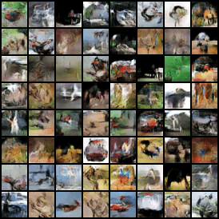

Quick Start with Python API
===========================

When it comes to tracking the performance of generative models as they train, evaluating metrics after every epoch
becomes prohibitively expensive due to long computation times. torch-fidelity tackles this problem by making full use
of caching to avoid recomputing common features and per-metric statistics whenever possible. Computing all metrics for
50000 32x32 generated images and `cifar10-train` takes only 2 min 26 seconds on NVIDIA P100 GPU, compared to >10 min if
using original codebases. Thus, computing metrics 20 times over the whole training cycle makes overall training time
just one hour longer.

In the following example, assume unconditional image generation setting with CIFAR-10, and the generative model
`generator`, which takes a 128-dimensional standard normal noise vector.

First, import the module:

.. code-block:: python

    import torch_fidelity

Wrap the generator with the :class:`torch_fidelity.GenerativeModelModuleWrapper` wrapper, and pass it to the
:func:`torch_fidelity.calculate_metrics` function. It can be called upon every epoch:

.. code-block:: python

    wrapped_generator = torch_fidelity.GenerativeModelModuleWrapper(generator, 128, 'normal', 0)

    metrics_dict = torch_fidelity.calculate_metrics(
        input1=wrapped_generator,
        input2='cifar10-train',
        cuda=True,
        isc=True,
        fid=True,
        kid=True,
        verbose=False,
    )

The resulting dictionary with computed metrics can logged directly to tensorboard, wandb, or console:

.. code-block:: python

    print(metrics_dict)

Output:

.. code-block:: python

    {
        'inception_score_mean': 11.23678,
        'inception_score_std': 0.09514061,
        'frechet_inception_distance': 18.12198,
        'kernel_inception_distance_mean': 0.01369556,
        'kernel_inception_distance_std': 0.001310059
    }

Example of Integration with the Training Loop
---------------------------------------------

Refer to :ref:`sngan_cifar10.py` for a complete training example.

Evolution of fixed generator latents in the example:

A generator checkpoint resulting from training the example can be downloaded
`here <https://github.com/toshas/torch-fidelity/releases/download/v0.2.0/example-sngan-cifar10-generator.pth>`_.

